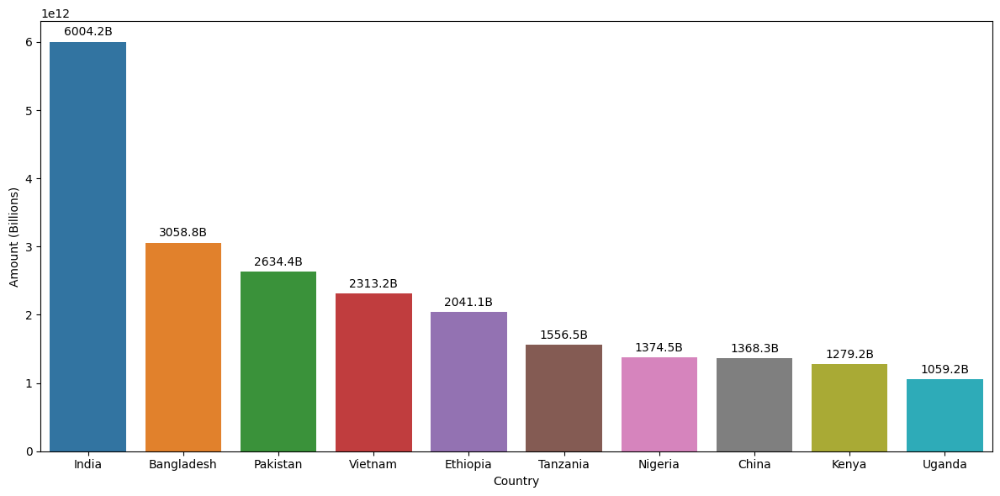
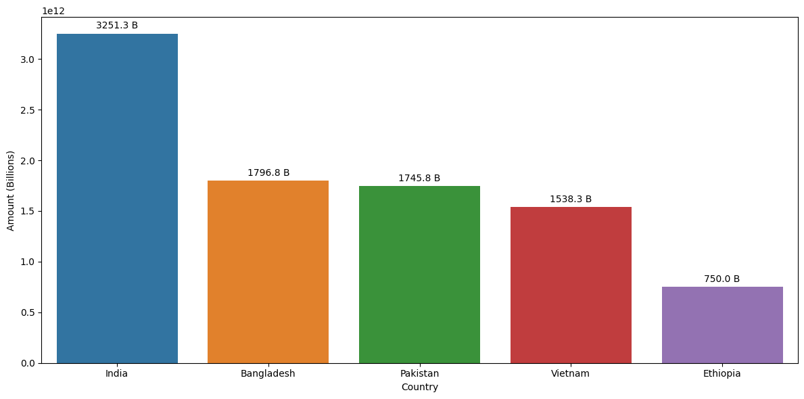
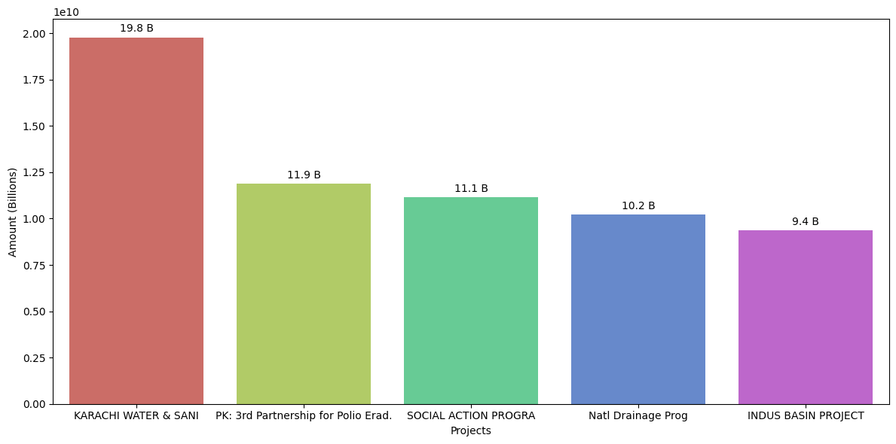
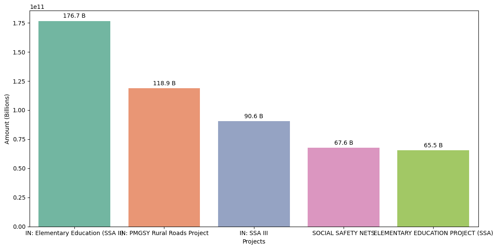
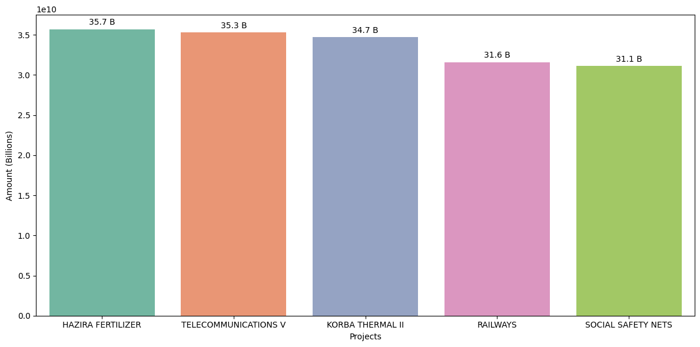
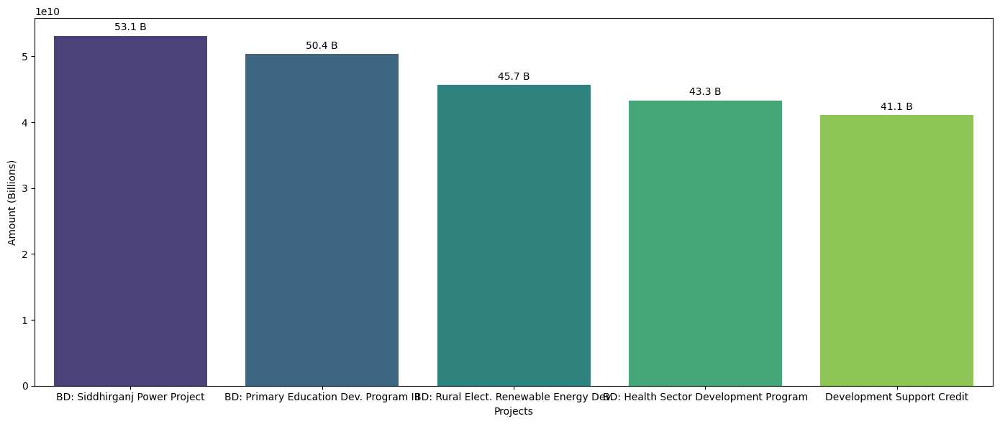

# **World Bank (International Development Association) Credits and Grants Data Analysis Project**
## Author:          Aftab Ahmad 
## Date:            20 July, 2024
## Contact:         aftabajk@gmail.com

# **``Introduction``**:
The World Bank is a global institution. By providing loans to the governments of its members, it helps them develop their economies and raise the living standards of their citizens, which is one of its major functions. The **International Development Association (IDA)** was founded in **1960** to eradicate poverty through the provision of grants and credits, or loans with zero to low interest rates. The programs' objectives are to raise economic growth, lessen inequality, and enhance people's quality of life.
I will examine the World Bank financial data, which includes details on the borrowing nations, in my capacity as a data analyst I also decided to compare the funding and repayments between **Pakistan**, **India**, and  **Bangladesh**.

My objective is to give the World Bank a thorough picture of the nations that are receiving IDA loans and to support them in making decisions that will improve their capacity to empower these nations in various ways.

# Scenario
Pakistan, Bangladesh, and India have faced economic challenges and have large populations living below the poverty line, it's important to note that these countries have diverse economies and varying levels of development. Taking loans from international financial institutions like the World Bank is a common practice for both developing and developed countries. Here are a few reasons why these countries might take loans:

- Infrastructure Development: Developing countries often require funds to invest in infrastructure projects such as roads, bridges, ports, and power plants. 
-	Social Development: Loans can be used to finance social development programs such as education, healthcare, and poverty alleviation. These countries may seek financial assistance to improve their social indicators and provide better services to their citizens.
-	Budgetary Support: Loans from international institutions can help countries bridge budget deficits and maintain macroeconomic stability. These loans provide temporary relief by filling gaps in revenue and expenditure, especially during economic downturns or crises.
-	Technological Advancement: Access to funds can facilitate the adoption and implementation of advanced technologies, which can enhance productivity, industrial growth, and competitiveness in the global market.

As a data analyst, exploring World Bank loans to Pakistan, India, and Bangladesh can provide valuable insights to help reduce the debt burden on these countries. My goal is to find valuable insights into how these countries can minimize their borrowing from the World Bank and how the World Bank should set up debt relief mechanisms for these countries.

# **``Key Findings``**
- Show all transactions from Pakistan, India, and Bangladesh and the status of their loans.
- How many total transactions were made in each of the three countries' interests?
- Which country has the most loans?
- What is the maximum amount owed to the IDA and how do India, Pakistan, and Bangladesh compare to these amounts?
- What were the most expensive projects in Pakistan and Bangladesh with the highest original principle amount?	
- What is the average amount Pakistan pays back to IDA?

### The Data
For this project, I am using a dataset from The World Bank. The Link for accessing this data is The World Bank Dataset All the data presented is available to everybody to analyze, visualize, and share with others. This is public data that analysts can use to explore how different borrowing nations are taking the loans. But Remember also to Read the Terms of Use associated with the use of data.
### Description of Data:
The data used for this project is in CSV file format and it is too large to open in Excel. First I download it and import it into Jupiter notebook using Pandas library to get a holistic sense of all the data. It has 991,848 rows and 30 columns. The data is regularly updated in real-time on a single transaction basis, ensuring there is no chance of duplicated information."

### Data Exploration:
Since this is a huge dataset I will be using Python to process and analyze the data. Python's extensive libraries, including Pandas, NumPy, Matplotlib, and Seaborn, offer robust capabilities for handling big data.  First, I explored this dataset and I discovered that it contains data regarding several nations that have obtained loans from the World Bank via the IDA International Development Association. There are numerous columns, as the data dictionary reveals, some of which are:

- Country
- Region
- Service Charge Rate
- Repaid to IDA
- Due to IDA
- Credit Status
- Cancelled
- Disbursed
- Undisbursed Amount
- Country Code
- Borrower
- Project Name
- Project ID

## Data Cleaning:
The dataset has a large number of columns, according to the data dictionary. This dataset contains historical snapshots of the IDA Statement of Credits and Grants including the latest available snapshot. The World Bank complies with all sanctions applicable to World Bank transactions. The chance of duplicated data is almost zero because IDA provides loans and grants to its member countries through proper channels. Upon examining the data set, I discovered that some columns were not necessary for the analysis I had in mind. I removed these columns names as **'End of Period'**, **'Credit Number'**, **'Country Code'**, **'Currency of Commitment'**, **'Project ID'**, **'Exchange Adjustment (US$)'**, **"Borrower's Obligation (US$)"**, **'Sold 3rd Party (US$)',** **'Repaid 3rd Party (US$)'**, **'Due 3rd Party (US$)'**, **'Credits Held (US$)'**, **'First Repayment Date'**, **'Last Repayment Date'**, **'Agreement Signing Date'**, **'Board Approval Date'**, **'Effective Date (Most Recent)'**,' **Closed Date (Most Recent)'**, and **'Last Disbursement Date'**. The bank carefully updates the data, ensuring there is no risk of data duplication.

# **``Analysis``**
I started the analysis by writing a code snippet to find how many total transactions have been made by the World Bank so far. By using COUNT we can see the total number of successful transactions are 1,304,779. To analyze how different countries are obtaining and repaying loans from the International Development Association (IDA) over time, I explored the data according to the different parameters.

## Top 10 Borrowing Countries from IDA:
To see which countries are getting loans from IDA, I wrote a piece of code to see how much Loan amount has been received by each country. I used the GROUP BY function to display the top 10 county’s transactions. 

A preliminary analysis of the World Bank data is surprising to see that these countries (India, Bangladesh, Pakistan) are among the top borrowers. The above plot is showing that India has received more loans and credits than any other country with  $ 6,004.22 billion followed by Bangladesh $ 3,058.82 billion and Pakistan $ 2,634..38 billion.

## Top 5 Countries With Outstanding Loans to IDA:
After developing an understanding of data, I decided to look at India, Pakistan, and Bangladesh in more detail.  I wanted to find out the top 5 countries that have the largest number of loans owed to IDA, I wrote a code snippet that showed the result.

India is the country with the highest amount of loans owed to IDA i.e $ 3251.3 billion followed by Bangladesh, Pakistan, Vietnam, and Nigeria. All these countries have been continuously borrowing loans from IDA for completing different projects.

## Top 50 Projects of World Bank for Pakistan:
In the current situation, the economy of Pakistan is facing a critical situation as the debt is increasing day by day. More loans are needed to pay the interest on previous loans. To check IDA's top 50 projects for Pakistan I wrote a code snippet which showed the following output.

We can see Pakistan is actively addressing its pressing infrastructure, energy, and water management challenges, it is also important to invest in the long-term development of its human capital through education and technology initiatives. A balanced approach to development can help the country achieve more sustainable and inclusive growth.

## Pakistan’s Top 5 Projects With The Highest Loan Amount:
An in-depth analysis of Pakistan's debt, which ranks third among borrowers, I wrote a piece of code that shows Pakistan's debt. It showed me the following results.

Pakistan obtained a substantial amount of loans for the following projects: Pakistan Earthquake ERC worth $ 97.7 billion; SAC II (Structural Adjustment Credit) worth $ 68.4 billion;  Pakistan PRSC I (Pakistan's PRSCs are one tranche programmatic operations designed to support the Government's medium-term program) worth $ 60.7 billion; Power Sector Reform DPC, worth $ 58.6 billion;  and Second Poverty Alleviation Fund Project, worth $ 55.6 billion.

## Top 5 Projects of Pakistan with Loan Repaid to IDA:
Then I checked the top 5 projects for which Pakistan has been paid back to IDA. I wrote the code snippet that showed me the following result.

The loan for the Pakistan Earthquake Emergency Recovery Credit (ERC) has not yet been repaid to the International Development Association (IDA). This fact creates an alarming situation for Pakistan's economy.

## India’s Top 5 Projects with the Highest Loan Amount:
Next, I analyzed the top 5 projects in India. To get the result I wrote the code snippet which showed me the results below.

I looked at the top five projects in India that required a significant amount of borrowing; they are called Elementary Education (SSA II), which cost $176.7 billion, PMGSY Rural Roads Project, which cost $118.9 billion, SSA III (Sarva Siksha Abhiyan), which cost $ 90.6 billion, Social Safety Nets, which cost $ 67.6 billion, and Elementary Education Project (Ssa), which cost $ 65.5 billion.

## Top 5 Projects of India with Loan Repaid to IDA:
After checking the top 5 projects I checked the top 5 projects for which India has been paid back to IDA. I wrote the code snippet that showed me the following result.

The result was also surprising for India because there was only one project for which India borrowed a huge amount, namely Social Safety Nets. The Social Safety Net Project has paid IDA with an appropriate amount. Hence a deeper analysis is also required here.

## Bangladesh’s Top 5 Projects with the Highest Loan Amount:
After analyzing the India's top 5 projects I moved on Bangladesh. I wrote a code snippet for the top 5 projects for which Bangladesh borrowed a huge amount. The code snippet showed me the following result.

The top five projects in Bangladesh that required a significant amount of borrowing are  Siddhirganj Power Project, which cost $ 53.1 billion; Primary Education Development Program III which cost $ 50.4 billion; 
Rural Elect. Renewable Energy which cost $ 45.7 billion; Health Sector Development Program, which cost $ 43.3 billion; and Development Support Credit, which cost $ 41.1 billion.
Similarly, after checking the top 5 projects I checked the top 5 projects for which Bangladesh has been paid back to IDA. I wrote the code snippet that showed me the following result.

The results of Bangladesh were similar to those of India and Pakistan. Among the top 5 projects, Bangladesh has also paid IDA against one project i.e. Social Safety Nets.

## Average Loan Repayments to the IDA:
I analyzed the percentage of loan repayments to the International Development Association (IDA) for Pakistan, India, and Bangladesh by writing specific code snippets for each country.

The calculated percentages are as follows:
Pakistan: 20.85%
India: 41.83%
Bangladesh: 23.07%
Based on these findings, we hypothesize that Pakistan's lower repayment rate to the IDA could be attributed to several factors, i.e. **(a) Pakistan may be experiencing slower economic growth, higher inflation, or other macroeconomic challenges that impact its ability to make repayments**. **(b) Government budget priorities and fiscal policies might prioritize other expenditures over international loan repayments**. **(3) Political instability or frequent changes in government could affect the consistency and effectiveness of financial policies related to debt repayment**. Understanding these underlying conditions is crucial for developing strategies to improve Pakistan's loan repayment performance to the IDA.

### General Notes: 
1.	The methodology used to derive these insights such as ‘Top 10 borrowing countries’, ‘Pakistan's top 5 projects with the highest loan amount’, ‘India's top 5 projects with the highest loan amount’ ‘Bangladesh's top 5 projects with the highest loan amount’ was to systematically sum the 'Disbursed Amount' and 'Undisbursed Amount' values for each relevant grouping (country, project) to determine the total loan commitments. This approach allowed for a comprehensive assessment of the lending portfolio and the identification of the most significant borrowing patterns and project-level financing.
2.	The percentage of loan repayments to the IDA was calculated by dividing the aggregate amount of the "Repaid to IDA (US$)" column by the "Disbursed Amount (US$)" column and multiplying the result by 100. 
3.	Original principal amount less canceled amount may not equal disbursed amount plus undisbursed amount due to exchange rate movements. 
4.	The disbursed amount less the repaid amount may not equal the borrower’s obligation due to exchange rate movements.

# **``Summary of Analysis``**
- As I observed IDA has a huge number of loans lent out to its member country. IDA lent out money to 138 counties. One of the biggest loan-taking countries was India. India has taken a loan of approximately $7,114.9 million 
- The top 5 countries that the IDA has lent out the most money to are India, Bangladesh, Pakistan, Ethiopia, and Vietnam.
- As I analyzed the top 5 countries that paid the most to IDA are India, Bangladesh, Pakistan, Vietnam, and Nigeria. Ethiopia has borrowed much more than Nigeria but paid less to IDA.
- As I calculate the percentage loan repayment to the IDA for India i.e. 44.91% Bangladesh i.e. 23.39% and Pakistan i.e 21.98 %. It might be possible India may achieve favorable attention from IDA for loans in the future because of its timely repayment behavior to IDA. 
- I analyzed that India and Bangladesh are investing in the education sector which could be the best investment while Pakistan is borrowing most of the money to meet its energy crisis and other development projects.

# **``Share``**
Through a rigorous data analysis process, I have extracted valuable insights that align with the stakeholder requirements. To effectively communicate these insights, I have developed a comprehensive dashboard that presents the data in a unified and visually compelling manner.
By integrating the dashboard into the decision-making process, the stakeholders can confidently navigate the data, uncover hidden opportunities, and address pressing challenges.

# **``Recommendations``**
1.	My recommendation to the World Bank is to provide interest rate exemptions on debts for countries facing frequent natural calamities, such as Pakistan. Natural disasters can have a significant economic impact on countries, making it difficult for them to service their debts.

2.	I would recommend that the World Bank should establish a targeted loan repayment mechanism for developing countries like Pakistan. Rather than placing the burden of debt servicing solely on the general population, the Bank should work collaboratively with national governments to devise a system that draws proportionate contributions from the elite and high-income segments of society. This approach would help mitigate the disproportionate impact on lower-income communities, ensuring a more equitable distribution of debt repayment responsibilities.

3.	My recommendation to the Ministry of Finance of Pakistan prioritize investments in the education sector nationwide. Education holds significant potential as a catalyst for achieving equitable development in Pakistan. Furthermore, such investments in education would lead to advancements in various fields such as information technology, and innovation. Consequently, this would drive economic growth by nurturing a skilled workforce capable of contributing to productivity gains across sectors.

4.	I would recommend that the World Bank should establish a specialized framework to evaluate and finance projects in developing countries that may not have a clear path to generating financial returns. Many critical infrastructure and social development initiatives in underserved regions lack commercial viability, yet hold immense value for uplifting communities and fostering long-term progress.

# **``Conclusion``**
The data analysis underscores the need for key Asian borrowing countries, such as Pakistan, India, and Bangladesh, to engage in constructive dialogue and implement targeted policy reforms to address their over-reliance on World Bank credits and grants. A collaborative and strategic approach between these countries and the World Bank is essential to fulfilling the institution's mission of supporting global prosperity and reducing poverty.

Thank you very much for reading my project.

Aftab Ahmad

## Resources
Please find the Jupyter Notebook file, Data dictionary file and PowerBI Dashboard available in my GitHub repository.
For the dashboard, you can also find it on my Tableau Public profile.
I would greatly appreciate your feedback and any suggestions you may have regarding this portfolio project work. Your input is valuable to me in further improving the analysis. Please feel free to share your thoughts by emailing me at aftabajk@gmail.com 

 #exploratory_data_analysis  #world_bank_credits_and_loan_data_analysis #ida_loan_data 

